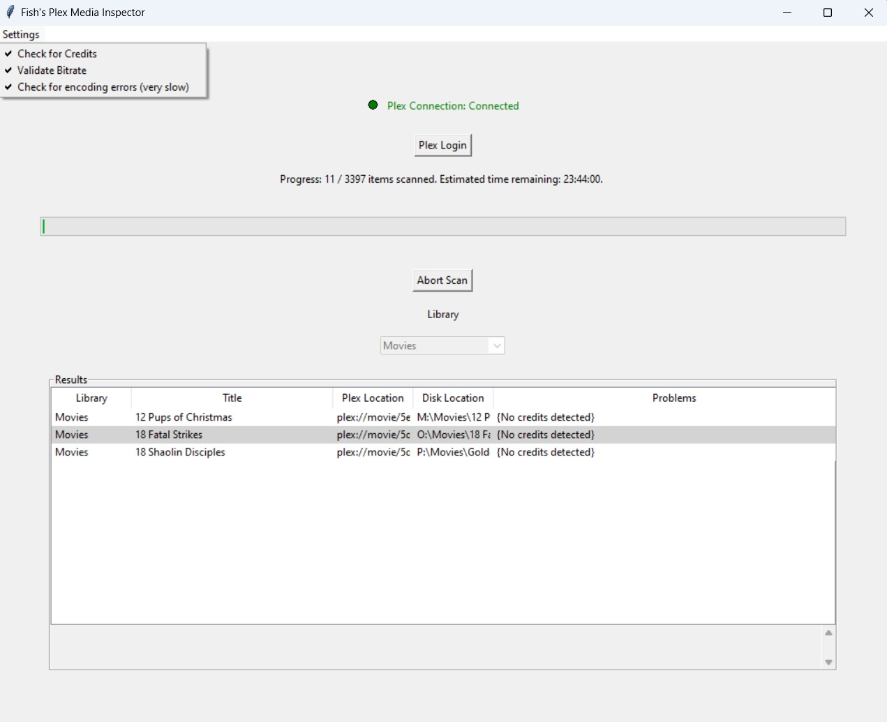

# Fish's Plex Media Inspector
My personal Plex server has more than 60,000 pieces of content. I am very careful in how I import data. Sometimes things go wrong and I need a way to do a deep inspection of the massive haystack. This Python code is written and tested on Window 11. 

## Current Inspection
The code currently checks Plex Library content for the following issues:
- **Missing credits**. This can be a symptom of a rip of content that terminated before it should have.
- **Missing bitrate**. If the bitrate is not detected by Plex, it's probably broken.
- **Corrupt video (very slow)**. I included `ffmpeg` for Windows 11 in this repo. If you enable that setting, it will do a full scan of the media file to detect any encoding errors.

## Set up
1) Click on Login to Plex
2) Give it your Plex Username
3) Give it your Plex Password. NOTE: If you have MFA enabled, add the 6 digit code to the end of your password.
The steps above will generate and store a token in the `settings.yaml` file for the current and future sessions so you shouldn't need to log in again (anytime soon.)
4) Under `Settings` select which scan features you want to enable
5) Click `Start Scan`

The results will dump to the UI and to `results.csv`

# Prototype Status
This code gets the job done but needs a lot of work to be usable by many users. If anyone is interested in contributing to the repo (or forking it off), please hit me up.

